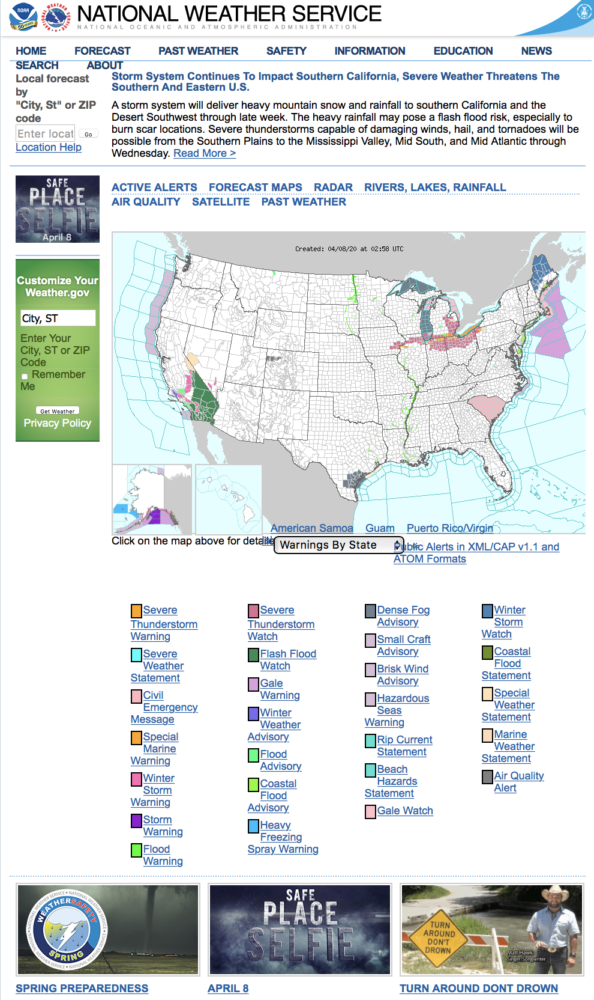
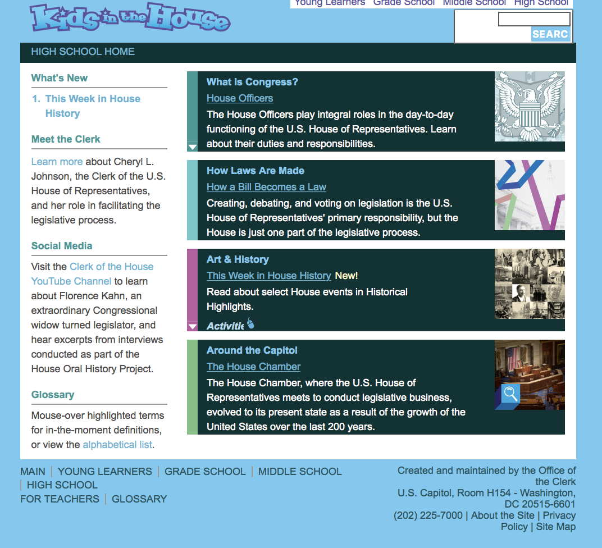

Publically Funded Government Websites 

Alexis Chung

Digital Humanities 150: User Experience Design 

Project Motivation: I want to contribute my UX design to publically funded websites which typically do not have the bandwidth to employ extensive staff to help with design and website functionality. The necessity for government related websites for information makes these two websites important for civil society and I think that with improved interface the usability will be improved as well as the amount of times people return to the sites.  

1st Website: National Weather Service 

<a href"https://www.weather.gov" target="_blank"> Weather </a>

Information: This website's function is to provide weather conditions and quality around the USA. 

Overall Evaluation: The website looks really archaic and it's home screen of the US map makes it look really haphazard and confusing at initial glance. The design is not aesthetic and the information is generally not organized well.

1. Visibility of System Status
The major weather patterns are dictated through text in a paragraph rather than through graphics would be easier to digest. Users can stay informed but have to read the update paragraph so it is a bit tedious to weed through. Also, you have to manually select your location on the map instead of having the website geo-locate for you, which also prolongs the amount of time it takes for you to receive information about your current location. (1)

2. Match Between System and the Real World 
The weather patterns are color coded, however with the over 30+ colors there is no logical or natural way that the weather situations such as warnings, advisories, or watch are organized. There are also public alerts that use technical language such as "XML," "CAP v1.1," and "ATOM" which not colloquial or easily identified language currently. (1)

3. User Control and Freedom 
When inputting mispellings for State, City, and zip code into the search bars the system does a good job at showing a list of possible answers based on your input. (0)

4. Consistency and Standards
The color coded legend underneath the map is not consistent as the labels are not congregated in similar rows or columns. It would be more consistent if the Warnings, Statements, Messages, Watches, and Advisories were all in the same column, but instead they are spread out and sporadic. (1)

5. Error Prevention
In the drop down "Warnings By State" menu, there is a blank value that you can choose that does not produce detailed map. This leaves room for error that the user may run into while trying to explore the map more in depth. (3)

6. Recognition Rather Than Recall 
If you click into an area on the map and then click on Watches, Warnings & Advisories, you are brought to a page that lists the warnings in text. However, you cannot view the geographical map side by side the description of the warning because you have to click back and forward to see the descriptions individually and the maps individually. This leads the user into having to remember what exactly the warning said when looking at the map on a separate page. (3)

7. Flexibility and Efficiency of Use 
The map feature is not efficient to use because you cannot enlarge the map after you have clicked into a certain area. You must reload the page in order to get the map to its full view, you cannot drag, shrink, or enlarge the map therefore making it inefficient to look up weather patterns in multiple areas on the map. (3) 

8. Aesthetic and Minimalist Design
There are so many little text tabs everywhere on the home page. Some are small, some are large, but the most irrelevant information which function like advertisements are the ones in the largest text. For example, the "Safe Place Selfie" and "Turn Around Don't Drown" pictures and texts are the largest, although they do not directly relate to weather information which is the purpose of this website. (2)

9. Help Users Recognize, Diagnose, and Recover from Errors
The website does correct you or tell you that your input was incorrect if you type in the wrong city, state, or zip code. (0)

10. Help and Documentation
The help section is mainly about Flash Player and Adobe Reader which are more technical. The Contact Us page has short paragraph answers rather than step by steps. These example questions seem to be quite small in the breadth of information it covers. (1)

2nd Website: Kids in the House 

<a href>https://kids-clerk.house.gov/high-school/lesson.html?intID=35

Information: This website is meant for students that want to learn more about Congress, the House, and the Senate. It is meant for educational and informational purposes. 

Overall Evaluation: This website has lots of text chunks rather than clearly defined labels with information underneath. The website looks very low quality and there is no real structure to the site. There seems to be just paragraph texts with nothing super helpful. 

1. Visibility of System Status
There is nothing that lets users know where you might be in the website. There's nothing that shows or indicates if a page is loading. Even if you try to make the interactive timeline visible, nothing pops up. (2)

2. Match Between System and the Real World 
There is match due to the basic and historical nature of this website. The terminology used is mainly political terms that most people know. (0)

3. User Control and Freedom 
If you want to move to different tabs within the site, there is no way to chronologically work your way back to the previous pages you were at. Therefore, if you were to accidentally click into another tab, you would be unable to undo that click and would rather have to start at the very beginning. (3)

4. Consistency and Standards 
There lack of website conventions such as a "Help," "Contact Us," or "About Us" tabs that you would usually find on a website. This really creates a lack in credibility. (2)

5. Error Prevention 
If you accidentally click on a tab, there is no clear way to get back to the page that you were on before. It would be helpful if it showed at the top of the page the steps that are in between your previous page and the one that you are on now. (1)

6. Recognition Rather Than Recall 
There are huge chunks of texts that make it difficult for users to digest information. If they needed to look back at a biography of a senator, they would have to click into their exact profile, there's nothing that neatly outlines their biographies. (1)

7. Flexibility and Efficiency of Use 
There are no frequent actions that you can do with this website because you have to manually click through each tab, each option, and each headline to get to where you need to be. This will require trial and error of you chosing the right options because the menu is quite unclear. (2). 

8. Aesthetic and Minimalist Design 
The design is really basic and the background sometimes render graphic images of the flag which make it quite disorienting. The colors of green and blue make the website feel like a science project rather than relating to politics. (3) 

9. Help Users Recognize, Diagnose, and Recover From Errors 
If you mistype in the search bar it doesn't give you suggestions such as "is this what you were looking for?" Rather, it just says no results found and no more information other than that. (1)

10. Help and Documentation 
There is no "contact us" or "help" that is built into the website. Users and students are therefore unable to get their questions answered, whether it's about the material or the website. (3)

